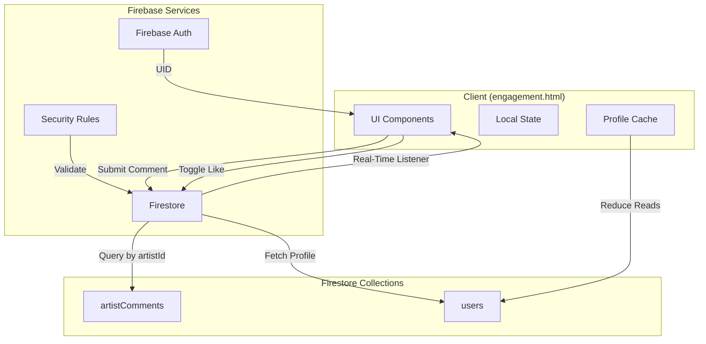

# Design Document: Artist Community Feeds with Firestore

## Overview

This design details the migration of the artist discussion system from localStorage to Firestore, transforming isolated single-user artist comments into a real-time multi-user community feed. The current implementation stores artist comments locally using keys like `tw_artist_comments_${artistId}`, meaning users can only see their own comments. The new system will store all artist comments in a centralized Firestore collection, enabling users to see and interact with comments from all community members in real-time while maintaining per-artist isolation.

### Key Changes

1. **Remove Artist Discussion Section from engagement.html**: The existing artist discussion UI (tabs, picker, panel) will be completely removed from engagement.html
2. **Firestore Data Layer**: Replace localStorage with Firestore for artist comment storage
3. **Real-Time Synchronization**: Implement Firestore listeners for automatic UI updates
4. **Security Rules**: Configure Firestore security rules to control access
5. **Privacy-First Display**: Show only usernames (not emails or full names)
6. **Per-Artist Isolation**: Maintain separate feeds for each artist using query filters

### Design Principles

- **Minimal UI Changes**: Preserve existing visual design and UX patterns
- **Real-Time First**: Use Firestore listeners for instant updates
- **Privacy by Default**: Display only usernames, never emails
- **Performance Optimized**: Limit queries, cache profiles, use composite indexes
- **Backward Compatible**: Gracefully handle missing data and network issues

## Architecture

### High-Level Architecture



### Data Flow

**Comment Submission Flow:**
1. User types comment in compose box
2. Client validates input (1-300 chars, non-empty artistId)
3. Client creates comment document with metadata
4. Client writes to Firestore `artistComments` collection
5. Firestore triggers real-time listener
6. All connected clients receive update
7. UI re-renders with new comment

**Like Toggle Flow:**
1. User clicks like button
2. Client uses Firestore `arrayUnion`/`arrayRemove` for atomic update
3. Firestore updates likes array
4. Real-time listener triggers
5. UI updates like count and button state

**Artist Feed Load Flow:**
1. User navigates to artist feed (from artist-details.html or search)
2. Client establishes Firestore listener with `where('artistId', '==', artistId)`
3. Firestore returns initial 50 comments ordered by `createdAt desc`
4. Client resolves author profiles (with caching)
5. UI renders comment list
6. Listener remains active for real-time updates

## Components and Interfaces

### Firestore Collection Schema

#### `artistComments` Collection

```typescript
interface ArtistComment {
  id: string;              // Auto-generated or timestamp-based
  artistId: string;        // MusicBrainz artist ID
  artistName: string;      // Artist name for display
  authorId: string;        // Firebase Auth UID
  authorName: string;      // Username at time of posting
  text: string;            // Comment content (1-300 chars)
  createdAt: Timestamp;    // Firestore Timestamp
  likes: string[];         // Array of UIDs who liked
  photoURL?: string;       // Optional author photo URL
}
```

**Composite Index Required:**
- `artistId` (Ascending) + `createdAt` (Descending)

This index enables efficient queries like:
```javascript
collection('artistComments')
  .where('artistId', '==', artistId)
  .orderBy('createdAt', 'desc')
  .limit(50)
```

### JavaScript Functions

#### Core Functions to Remove

These functions will be completely removed from engagement.html:

```javascript
// Main view switching
function switchMainView(view)

// Artist search
function searchArtistMB()

// Artist selection
function selectArtist(artist)
function closeArtistPanel()

// Comment operations
function submitArtistComment()
function toggleArtistCommentLike(commentId)
function renderArtistComments()
function buildArtistCommentElement(comment, cu)

// URL parameter handling
function checkArtistUrlParam()

// Storage helpers
function artistCommentsKey(artistId)
function loadArtistComments(artistId)
function saveArtistComments(artistId, comments)
function loadRecentArtists()
function saveRecentArtist(artist)
function renderRecentArtistChips()
```

#### HTML Elements to Remove

```html
<!-- Main view tabs -->
<div class="main-view-tabs" id="main-view-tabs">...</div>

<!-- Artist picker card -->
<div class="artist-picker-card" id="artist-picker-card">...</div>

<!-- Artist discussion panel -->
<div class="artist-discussion-panel" id="artist-discussion-panel">...</div>

<!-- Artist view container -->
<div id="view-artists" style="display:none;">...</div>
```

#### CSS Styles to Remove

All styles related to:
- `.main-view-tabs`, `.main-view-tab`
- `.artist-picker-card`, `.ap-*` classes
- `.artist-discussion-panel`, `.adp-*` classes
- `.artist-compose`, `.artist-compose-input`, `.artist-compose-actions`
- `.artist-comments-list`, `.artist-comment-empty`
- `.ap-recent-*`, `.ap-result-*`, `.ap-search-*`

### Integration with artist-details.html

Since the artist discussion section is being removed from engagement.html, navigation from artist-details.html will need to be updated. The current implementation uses URL parameters:

```javascript
// Current: Links to engagement.html?artist=ID&artistName=NAME
// After removal: This navigation should be removed or redirected
```

**Recommendation**: Remove or disable artist discussion links in artist-details.html, or redirect them to a placeholder/coming-soon page.

## Data Models

### Firestore Document Structure

#### Artist Comment Document

```javascript
{
  id: "ac1704067200000_abc123",
  artistId: "5b11f4ce-a62d-471e-81fc-a69a8278c7da",
  artistName: "Nirvana",
  authorId: "firebase_uid_123",
  authorName: "musicfan42",
  text: "Their Unplugged album is a masterpiece!",
  createdAt: Timestamp(2024, 0, 1, 12, 0, 0),
  likes: ["firebase_uid_456", "firebase_uid_789"],
  photoURL: "https://..."
}
```

### User Profile Cache

To minimize Firestore reads, implement an in-memory cache:

```javascript
const userProfileCache = new Map();

async function resolveAuthor(uid, currentUser) {
  if (!uid) return { username: '', photoURL: '' };
  if (currentUser && uid === currentUser.uid) return currentUser;
  if (userProfileCache.has(uid)) return userProfileCache.get(uid);
  
  try {
    const snap = await getDoc(doc(db, 'users', uid));
    const profile = snap.exists()
      ? { username: snap.data().username ?? '', photoURL: snap.data().photoURL ?? '' }
      : { username: '', photoURL: '' };
    userProfileCache.set(uid, profile);
    return profile;
  } catch {
    const fallback = { username: '', photoURL: '' };
    userProfileCache.set(uid, fallback);
    return fallback;
  }
}
```

### localStorage Keys to Remove

```javascript
// Remove these keys and all related code:
const RECENT_ARTISTS_KEY = 'tw_recent_artists';
function artistCommentsKey(artistId) {
  return `tw_artist_comments_${artistId}`;
}
```

## Error Handling

### Error Scenarios and Handling

#### 1. Network Disconnection

**Scenario**: User loses internet connection while viewing artist feed

**Handling**:
```javascript
// Firestore automatically handles offline persistence
// Enable offline persistence in Firebase initialization:
enableIndexedDbPersistence(db).catch((err) => {
  if (err.code === 'failed-precondition') {
    console.warn('Persistence failed: multiple tabs open');
  } else if (err.code === 'unimplemented') {
    console.warn('Persistence not available in this browser');
  }
});

// Show reconnection indicator
let isOnline = true;
window.addEventListener('online', () => {
  isOnline = true;
  showToast('Reconnected! 🌐', 'success');
});
window.addEventListener('offline', () => {
  isOnline = false;
  showToast('You are offline. Changes will sync when reconnected.', 'error');
});
```

#### 2. Comment Submission Failure

**Scenario**: Firestore write fails due to permissions or network

**Handling**:
```javascript
async function submitArtistComment() {
  const input = document.getElementById('adp-comment-input');
  const text = input?.value.trim();
  
  if (!text) {
    showToast('Write something first!', 'error');
    return;
  }
  
  if (text.length > 300) {
    showToast('Comment too long (max 300 characters)', 'error');
    return;
  }
  
  const submitBtn = document.getElementById('submit-comment-btn');
  submitBtn.disabled = true;
  submitBtn.textContent = 'Posting...';
  
  try {
    await addDoc(collection(db, 'artistComments'), {
      artistId: activeArtist.id,
      artistName: activeArtist.name,
      authorId: currentUser.uid,
      authorName: currentUser.username || '',
      text,
      createdAt: serverTimestamp(),
      likes: [],
      photoURL: currentUser.photoURL || ''
    });
    
    input.value = '';
    showToast('Comment posted! 🎵', 'success');
  } catch (error) {
    console.error('Failed to post comment:', error);
    showToast('Failed to post comment. Please try again.', 'error');
    // Keep user's text in input for retry
  } finally {
    submitBtn.disabled = false;
    submitBtn.textContent = 'Post';
  }
}
```

#### 3. Like Toggle Failure

**Scenario**: Atomic update fails

**Handling**:
```javascript
async function toggleArtistCommentLike(commentId) {
  const commentRef = doc(db, 'artistComments', commentId);
  const isLiked = /* check current state */;
  
  try {
    await updateDoc(commentRef, {
      likes: isLiked 
        ? arrayRemove(currentUser.uid)
        : arrayUnion(currentUser.uid)
    });
  } catch (error) {
    console.error('Failed to toggle like:', error);
    showToast('Failed to update like. Please try again.', 'error');
    // UI will revert via real-time listener
  }
}
```

#### 4. Missing User Profile

**Scenario**: Author's user document doesn't exist or is inaccessible

**Handling**:
```javascript
// Already handled in resolveAuthor() with fallback:
const fallback = { username: '', photoURL: '' };
// Display as "Anonymous" in UI
```

#### 5. Invalid Artist ID

**Scenario**: User navigates with malformed or missing artistId

**Handling**:
```javascript
function selectArtist(artist) {
  if (!artist || !artist.id || !artist.name) {
    showToast('Invalid artist selection', 'error');
    return;
  }
  // Proceed with valid artist
}
```

#### 6. Firestore Query Failure

**Scenario**: Listener setup fails or query times out

**Handling**:
```javascript
function setupArtistFeedListener(artistId) {
  try {
    const q = query(
      collection(db, 'artistComments'),
      where('artistId', '==', artistId),
      orderBy('createdAt', 'desc'),
      limit(50)
    );
    
    const unsubscribe = onSnapshot(q, 
      (snapshot) => {
        // Handle updates
        renderArtistComments(snapshot.docs);
      },
      (error) => {
        console.error('Listener error:', error);
        showToast('Failed to load comments. Please refresh.', 'error');
        // Show retry button
        showRetryButton();
      }
    );
    
    return unsubscribe;
  } catch (error) {
    console.error('Failed to setup listener:', error);
    showToast('Failed to connect to comments feed', 'error');
    return null;
  }
}
```

### Error Logging

All errors should be logged to console with context:

```javascript
function logError(context, error, metadata = {}) {
  console.error(`[${context}]`, error, metadata);
  // In production, send to error tracking service (e.g., Sentry)
}

// Usage:
logError('submitArtistComment', error, { artistId, textLength: text.length });
```

## Testing Strategy

### Unit Tests

Since this feature involves removing code rather than adding complex logic, unit tests will focus on:

1. **Validation Functions**: Test input validation (text length, empty checks)
2. **Profile Resolution**: Test `resolveAuthor()` caching behavior
3. **Error Handling**: Test error scenarios with mocked Firestore failures

**Example Test (using Vitest):**

```javascript
import { describe, it, expect, vi } from 'vitest';

describe('Artist Comment Validation', () => {
  it('should reject empty comments', () => {
    const result = validateCommentText('');
    expect(result.valid).toBe(false);
    expect(result.error).toBe('Comment cannot be empty');
  });
  
  it('should reject comments over 300 characters', () => {
    const longText = 'a'.repeat(301);
    const result = validateCommentText(longText);
    expect(result.valid).toBe(false);
    expect(result.error).toContain('300 characters');
  });
  
  it('should accept valid comments', () => {
    const result = validateCommentText('Great artist!');
    expect(result.valid).toBe(true);
  });
});

describe('Profile Cache', () => {
  it('should return cached profile on second call', async () => {
    const mockGetDoc = vi.fn().mockResolvedValue({
      exists: () => true,
      data: () => ({ username: 'testuser', photoURL: 'https://...' })
    });
    
    const profile1 = await resolveAuthor('uid123', null);
    const profile2 = await resolveAuthor('uid123', null);
    
    expect(mockGetDoc).toHaveBeenCalledTimes(1); // Only called once
    expect(profile1).toEqual(profile2);
  });
});
```

### Integration Tests

Integration tests will verify:

1. **Firestore Operations**: Test actual Firestore reads/writes in emulator
2. **Real-Time Listeners**: Verify listeners trigger on data changes
3. **Security Rules**: Test that rules correctly allow/deny operations

**Example Integration Test:**

```javascript
import { describe, it, expect, beforeEach } from 'vitest';
import { initializeTestEnvironment } from '@firebase/rules-unit-testing';

describe('Artist Comments Firestore Integration', () => {
  let testEnv;
  let db;
  
  beforeEach(async () => {
    testEnv = await initializeTestEnvironment({
      projectId: 'test-project',
      firestore: { rules: /* load rules */ }
    });
    db = testEnv.authenticatedContext('user123').firestore();
  });
  
  it('should allow authenticated user to create comment', async () => {
    const commentRef = await addDoc(collection(db, 'artistComments'), {
      artistId: 'artist123',
      artistName: 'Test Artist',
      authorId: 'user123',
      authorName: 'testuser',
      text: 'Great music!',
      createdAt: serverTimestamp(),
      likes: []
    });
    
    expect(commentRef.id).toBeDefined();
  });
  
  it('should allow user to like comment', async () => {
    const commentRef = doc(db, 'artistComments', 'comment123');
    await updateDoc(commentRef, {
      likes: arrayUnion('user123')
    });
    
    const snap = await getDoc(commentRef);
    expect(snap.data().likes).toContain('user123');
  });
});
```

### Manual Testing Checklist

- [ ] Remove artist discussion UI elements from engagement.html
- [ ] Remove artist discussion CSS from engagement-page.css
- [ ] Remove artist discussion JavaScript functions
- [ ] Remove localStorage keys for artist comments
- [ ] Verify engagement.html loads without errors
- [ ] Verify community feed still works correctly
- [ ] Verify no broken links from artist-details.html
- [ ] Test responsive layout after removal
- [ ] Verify no console errors related to removed functions

### Performance Testing

- **Query Performance**: Measure time to load 50 comments
- **Listener Overhead**: Monitor memory usage with active listeners
- **Cache Hit Rate**: Track profile cache effectiveness
- **Network Usage**: Measure Firestore read/write counts

**Target Metrics:**
- Initial load: < 500ms
- Real-time update latency: < 200ms
- Profile cache hit rate: > 80%
- Firestore reads per page load: < 60

## Security Rules

### Firestore Security Rules

```javascript
rules_version = '2';
service cloud.firestore {
  match /databases/{database}/documents {
    
    // Artist Comments Collection
    match /artistComments/{commentId} {
      
      // Anyone authenticated can read comments
      allow read: if request.auth != null;
      
      // Authenticated users can create comments
      // Must include required fields and authorId must match auth UID
      allow create: if request.auth != null
        && request.resource.data.keys().hasAll([
          'artistId', 'artistName', 'authorId', 'authorName', 
          'text', 'createdAt', 'likes'
        ])
        && request.resource.data.authorId == request.auth.uid
        && request.resource.data.text is string
        && request.resource.data.text.size() >= 1
        && request.resource.data.text.size() <= 300
        && request.resource.data.artistId is string
        && request.resource.data.artistId.size() > 0
        && request.resource.data.likes is list;
      
      // Users can update only the likes array
      // Cannot modify text, authorId, artistId, or createdAt
      allow update: if request.auth != null
        && request.resource.data.diff(resource.data).affectedKeys()
          .hasOnly(['likes'])
        && request.resource.data.likes is list;
      
      // Users can delete only their own comments
      allow delete: if request.auth != null
        && resource.data.authorId == request.auth.uid;
    }
    
    // Users Collection (for profile lookups)
    match /users/{userId} {
      allow read: if request.auth != null;
      allow write: if request.auth != null && request.auth.uid == userId;
    }
  }
}
```

### Security Rule Validation

**Test Cases:**

1. **Unauthenticated Read**: Should DENY
2. **Authenticated Read**: Should ALLOW
3. **Create with Valid Data**: Should ALLOW
4. **Create with Missing Fields**: Should DENY
5. **Create with Wrong authorId**: Should DENY
6. **Create with Empty Text**: Should DENY
7. **Create with Text > 300 chars**: Should DENY
8. **Update Likes Array**: Should ALLOW
9. **Update Text Field**: Should DENY
10. **Delete Own Comment**: Should ALLOW
11. **Delete Other's Comment**: Should DENY

**Testing with Firebase Emulator:**

```javascript
import { assertFails, assertSucceeds } from '@firebase/rules-unit-testing';

describe('Security Rules', () => {
  it('should deny unauthenticated reads', async () => {
    const unauthedDb = testEnv.unauthenticatedContext().firestore();
    await assertFails(getDoc(doc(unauthedDb, 'artistComments', 'comment123')));
  });
  
  it('should allow authenticated reads', async () => {
    const authedDb = testEnv.authenticatedContext('user123').firestore();
    await assertSucceeds(getDoc(doc(authedDb, 'artistComments', 'comment123')));
  });
  
  it('should deny create with wrong authorId', async () => {
    const db = testEnv.authenticatedContext('user123').firestore();
    await assertFails(addDoc(collection(db, 'artistComments'), {
      authorId: 'user456', // Wrong UID
      artistId: 'artist123',
      text: 'Test',
      // ... other fields
    }));
  });
});
```

## Performance Optimization

### 1. Composite Indexes

**Required Index:**
```
Collection: artistComments
Fields: artistId (Ascending), createdAt (Descending)
```

This index is automatically created when you run the first query. Alternatively, create it manually in Firebase Console or via `firestore.indexes.json`:

```json
{
  "indexes": [
    {
      "collectionGroup": "artistComments",
      "queryScope": "COLLECTION",
      "fields": [
        { "fieldPath": "artistId", "order": "ASCENDING" },
        { "fieldPath": "createdAt", "order": "DESCENDING" }
      ]
    }
  ]
}
```

### 2. Query Limits

Limit initial queries to 50 comments to reduce data transfer:

```javascript
const q = query(
  collection(db, 'artistComments'),
  where('artistId', '==', artistId),
  orderBy('createdAt', 'desc'),
  limit(50)
);
```

### 3. Pagination (Future Enhancement)

For artists with > 50 comments, implement pagination:

```javascript
let lastVisible = null;

async function loadMoreComments() {
  const q = lastVisible
    ? query(
        collection(db, 'artistComments'),
        where('artistId', '==', artistId),
        orderBy('createdAt', 'desc'),
        startAfter(lastVisible),
        limit(20)
      )
    : query(
        collection(db, 'artistComments'),
        where('artistId', '==', artistId),
        orderBy('createdAt', 'desc'),
        limit(50)
      );
  
  const snapshot = await getDocs(q);
  lastVisible = snapshot.docs[snapshot.docs.length - 1];
  return snapshot.docs;
}
```

### 4. Profile Caching

Implement in-memory cache to reduce Firestore reads:

```javascript
const userProfileCache = new Map();

async function resolveAuthor(uid, currentUser) {
  // Check cache first
  if (userProfileCache.has(uid)) {
    return userProfileCache.get(uid);
  }
  
  // Fetch from Firestore
  const profile = await fetchProfile(uid);
  userProfileCache.set(uid, profile);
  return profile;
}
```

**Cache Invalidation**: Clear cache on page reload or after 5 minutes:

```javascript
// Clear cache every 5 minutes
setInterval(() => {
  userProfileCache.clear();
}, 5 * 60 * 1000);
```

### 5. Debounce Like Clicks

Prevent excessive writes from rapid clicking:

```javascript
let likeDebounceTimer = null;

function toggleArtistCommentLike(commentId) {
  clearTimeout(likeDebounceTimer);
  likeDebounceTimer = setTimeout(async () => {
    await performLikeToggle(commentId);
  }, 300);
}
```

### 6. Offline Persistence

Enable Firestore offline persistence for better perceived performance:

```javascript
import { enableIndexedDbPersistence } from 'firebase/firestore';

enableIndexedDbPersistence(db).catch((err) => {
  if (err.code === 'failed-precondition') {
    console.warn('Persistence failed: multiple tabs open');
  } else if (err.code === 'unimplemented') {
    console.warn('Persistence not available');
  }
});
```

### 7. Listener Cleanup

Always unsubscribe from listeners when navigating away:

```javascript
let unsubscribeArtistFeed = null;

function selectArtist(artist) {
  // Unsubscribe from previous listener
  if (unsubscribeArtistFeed) {
    unsubscribeArtistFeed();
  }
  
  // Setup new listener
  unsubscribeArtistFeed = onSnapshot(q, (snapshot) => {
    renderArtistComments(snapshot.docs);
  });
}

function closeArtistPanel() {
  if (unsubscribeArtistFeed) {
    unsubscribeArtistFeed();
    unsubscribeArtistFeed = null;
  }
}

// Cleanup on page unload
window.addEventListener('beforeunload', () => {
  if (unsubscribeArtistFeed) {
    unsubscribeArtistFeed();
  }
});
```

### Performance Monitoring

Track key metrics:

```javascript
// Log query performance
const startTime = performance.now();
const snapshot = await getDocs(q);
const duration = performance.now() - startTime;
console.log(`Query took ${duration}ms, returned ${snapshot.size} docs`);

// Track cache hit rate
let cacheHits = 0;
let cacheMisses = 0;

function resolveAuthor(uid) {
  if (userProfileCache.has(uid)) {
    cacheHits++;
  } else {
    cacheMisses++;
  }
  // ... rest of function
}

// Log cache stats periodically
setInterval(() => {
  const hitRate = cacheHits / (cacheHits + cacheMisses);
  console.log(`Profile cache hit rate: ${(hitRate * 100).toFixed(1)}%`);
}, 60000);
```

## Implementation Summary

This design focuses on **removing** the artist discussion feature from engagement.html rather than migrating it to Firestore. The key implementation steps are:

1. **Remove HTML Elements**: Delete all artist discussion UI components
2. **Remove JavaScript Functions**: Delete all artist-related functions
3. **Remove CSS Styles**: Delete all artist discussion styles
4. **Remove localStorage Keys**: Clean up artist comment storage
5. **Update Navigation**: Remove or redirect links from artist-details.html
6. **Test Thoroughly**: Ensure engagement.html works correctly after removal

The Firestore migration details provided in this document serve as a reference for future implementation if the feature is re-added in a different location or as a standalone page.

