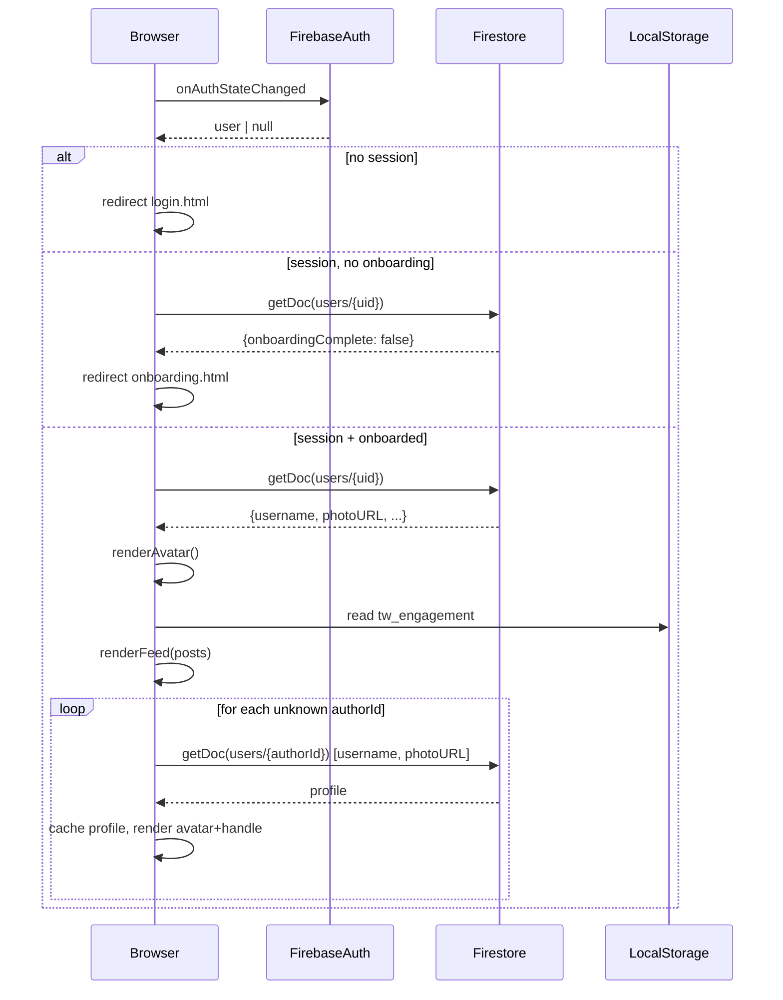

# Design Document

## Feature: Engagement Navbar & User Accounts

---

## Overview

This feature replaces the placeholder navbar elements on `engagement.html` (and `shop.html`) with a real authenticated user identity component — the Avatar Button — backed by Firebase Authentication and Firestore. It also removes the hardcoded `USERS` demo object from the engagement page and replaces it with live user data fetched from Firestore, displaying only usernames (never full names) throughout the community feed.

The changes are scoped to three files:
- `frontend/engagement.html` — primary target: auth guard, avatar nav, real user data, username-only display
- `frontend/shop.html` — secondary target: avatar nav when authenticated, fallback to existing buttons when not
- `styles/dashboard-page.css` — already contains the canonical avatar/dropdown CSS; engagement.html will reuse these classes

No new backend infrastructure is required. Firebase Auth and Firestore are already in use on `dashboard.html` with the same project config.

---

## Architecture

The feature is entirely client-side. The architecture follows the same module pattern already established in `dashboard.html`:

```
Page Load
  └─ Firebase SDK (ESM module)
       ├─ initializeApp(firebaseConfig)
       ├─ getAuth → onAuthStateChanged
       │    ├─ null user → redirect login.html
       │    ├─ user, onboardingComplete=false → redirect onboarding.html
       │    └─ user, onboardingComplete=true
       │         ├─ getDoc(users/{uid}) → load username, photoURL
       │         ├─ renderAvatar(navBtn, dropdownHeader)
       │         ├─ patchSeedData(currentUser.uid)
       │         └─ renderFeed() → resolveAuthor(uid) → userProfileCache
       └─ getFirestore → doc reads (username, photoURL only)
```

The `userProfileCache` is a plain `Map<uid, {username, photoURL}>` held in module scope. It is populated lazily on first access and reused for all subsequent lookups within the page session.



---

## Components and Interfaces

### 1. Auth Guard

Wraps the entire page initialisation inside `onAuthStateChanged`. No content is rendered until the auth state is resolved.

```js
onAuthStateChanged(auth, async (user) => {
  if (!user) { window.location.href = './login.html'; return; }
  const snap = await getDoc(doc(db, 'users', user.uid));
  const data = snap.exists() ? snap.data() : {};
  if (!data.onboardingComplete) { window.location.href = './onboarding.html'; return; }
  // ... proceed
});
```

### 2. Avatar Button & Dropdown

Reuses the CSS classes from `dashboard-page.css` verbatim:

| Element | Class | Notes |
|---|---|---|
| Wrapper | `.nav-avatar-wrap` | `position: relative`, toggled `.open` |
| Button | `.nav-av-btn` | 40px circle, `border: 2.5px solid transparent` |
| Dropdown panel | `.nav-dropdown` | Absolutely positioned, opacity/transform animated |
| User header row | `.drop-user` | Avatar mini + username handle |
| Nav items | `.drop-item` | Dashboard, Community links |
| Sign out | `.drop-item.danger` | Calls `signOut(auth)` |

Avatar rendering logic (shared between nav button and dropdown mini-avatar):

```js
function renderAvatar(el, { username, photoURL }) {
  if (photoURL) {
    el.innerHTML = ``;
  } else {
    el.textContent = (username || '?').charAt(0).toUpperCase();
    el.style.background = 'linear-gradient(135deg, var(--blue), #7c3aed)';
  }
}
```

Dropdown toggle (identical pattern to `dashboard.html`):

```js
avBtn.addEventListener('click', e => {
  e.stopPropagation();
  const open = wrap.classList.toggle('open');
  avBtn.setAttribute('aria-expanded', open);
});
document.addEventListener('click', e => {
  if (!wrap.contains(e.target)) {
    wrap.classList.remove('open');
    avBtn.setAttribute('aria-expanded', 'false');
  }
});
```

### 3. User Profile Cache

```js
const userProfileCache = new Map(); // uid → { username, photoURL }

async function resolveAuthor(uid, currentUser) {
  if (uid === currentUser.uid) return currentUser;
  if (userProfileCache.has(uid)) return userProfileCache.get(uid);
  try {
    const snap = await getDoc(doc(db, 'users', uid));
    const profile = snap.exists()
      ? { username: snap.data().username ?? '', photoURL: snap.data().photoURL ?? '' }
      : { username: '', photoURL: '' };
    userProfileCache.set(uid, profile);
    return profile;
  } catch {
    const fallback = { username: '', photoURL: '' };
    userProfileCache.set(uid, fallback);
    return fallback;
  }
}
```

Fallback display: when `username` is empty/falsy, the author handle renders as `@unknown` in feed contexts and as the user's email in the dropdown header.

### 4. Avatar Color Hash

Deterministic hue derivation from a string (UID or username):

```js
function hashStr(s) {
  let h = 0;
  for (let i = 0; i < s.length; i++) h = (Math.imul(31, h) + s.charCodeAt(i)) | 0;
  return h;
}

function avatarColor(uid) {
  const hue = Math.abs(hashStr(uid)) % 360;
  return `hsl(${hue}, 65%, 48%)`;
}
```

This replaces the hardcoded per-user colours in the `USERS` object. The same UID always produces the same colour within and across sessions.

### 5. Seed Data Patch

After the current user's UID is known, seed posts that previously used `authorId: 'you'` are updated:

```js
function patchSeedData(uid) {
  SEED_POSTS.forEach(p => { if (p.authorId === 'you') p.authorId = uid; });
  // same for SEED_COMMENTS, SEED_REPLIES
}
```

### 6. shop.html Navbar Update

`shop.html` gets a lightweight auth check that swaps the nav-end content:

```js
onAuthStateChanged(auth, (user) => {
  const navEnd = document.querySelector('.nav-end');
  if (user) {
    // Replace Support + Log In + Get Started with Avatar Button
    navEnd.innerHTML = avatarButtonHTML();
    // fetch username/photoURL and render avatar
  }
  // else: leave existing buttons untouched
});
```

---

## Data Models

### Current User (in-memory, page session)

```ts
interface CurrentUser {
  uid: string;          // Firebase Auth UID
  username: string;     // Firestore users/{uid}.username
  photoURL: string;     // Firebase Auth user.photoURL (may be empty)
  email: string;        // Firebase Auth user.email (fallback identity label)
}
```

### Cached Author Profile (in-memory)

```ts
interface AuthorProfile {
  username: string;   // Firestore users/{uid}.username
  photoURL: string;   // Firestore users/{uid}.photoURL
}
// Map<uid: string, AuthorProfile>
```

### Firestore Read Shape

When fetching other users' profiles, only two fields are requested:

```js
// Firestore SDK does not support server-side field masks via getDoc in the web SDK,
// so we destructure only the needed fields client-side:
const { username = '', photoURL = '' } = snap.data();
```

### Engagement Storage (unchanged)

Posts, comments, and replies continue to be stored in `localStorage` under the key `tw_engagement`. The only change is that `authorId` values previously set to `'you'` are replaced with the real Firebase UID at runtime via `patchSeedData`.

---

## Correctness Properties

*A property is a characteristic or behavior that should hold true across all valid executions of a system — essentially, a formal statement about what the system should do. Properties serve as the bridge between human-readable specifications and machine-verifiable correctness guarantees.*

### Property 1: Avatar Initial Derivation

*For any* non-empty username string, the avatar initial displayed SHALL equal the first character of that username converted to uppercase.

**Validates: Requirements 2.4, 5.2**

---

### Property 2: Username-Only Display

*For any* user profile with a non-empty `username`, `firstName`, and `lastName`, every rendered author identity string in the feed (posts, comments, replies, leaderboard, compose box, and dropdown header) SHALL equal `"@" + username` and SHALL NOT contain `firstName` or `lastName` as a substring.

**Validates: Requirements 4.1, 4.2, 4.3, 2.8**

---

### Property 3: Author Handle Rendering

*For any* post or comment whose `authorId` maps to a user profile with a known `username`, the rendered author handle in the feed SHALL equal `"@" + username`.

**Validates: Requirements 3.3, 3.4**

---

### Property 4: User Profile Cache Idempotence

*For any* author UID, resolving that author's profile N times (N ≥ 1) within a single page session SHALL result in exactly one Firestore `getDoc` call for that UID, with all subsequent resolutions served from the in-memory cache.

**Validates: Requirements 3.6**

---

### Property 5: Avatar Color Determinism

*For any* UID or username string, calling the avatar color derivation function multiple times with the same input SHALL always return the same HSL color value.

**Validates: Requirements 5.1, 5.4**

---

## Error Handling

| Scenario | Behaviour |
|---|---|
| No Firebase session | Redirect to `login.html` immediately |
| Session exists, `onboardingComplete` is false | Redirect to `onboarding.html` |
| Firestore unavailable on page load | Render feed from `localStorage` seed data; avatar shows initial from Auth `displayName` or `?` |
| `getDoc` for an author UID fails | Cache a fallback `{ username: '', photoURL: '' }`; display `@unknown` in feed |
| `getDoc` returns no document for an author UID | Same as above — `@unknown` |
| `username` field empty for current user | Dropdown header shows `user.email` as identity label |
| `username` field empty for a feed author | Display `@unknown` |
| `photoURL` is present but image fails to load | `onerror` handler falls back to initial letter rendering |
| `signOut` throws | Log error to console; redirect to `login.html` regardless |

---

## Testing Strategy

### Unit Tests (example-based)

Focus on specific scenarios and edge cases:

- Auth guard redirects: null user → `login.html`, user without onboarding → `onboarding.html`
- Avatar rendering: with `photoURL` → `` rendered; without → initial letter shown
- Dropdown toggle: click opens, click again closes, outside click closes
- Sign out: `signOut` called, redirect to `login.html`
- Fallback display: empty username → `@unknown` in feed, email in dropdown
- Missing avatar username → `?` initial with grey background
- `shop.html` nav: authenticated → avatar shown, unauthenticated → original buttons shown
- Seed data patch: after auth, seed posts with `authorId === 'you'` are replaced with real UID
- Firestore unavailable: page renders with cached/seed data, no crash

### Property-Based Tests

Use a property-based testing library (e.g., [fast-check](https://github.com/dubzzz/fast-check) for JavaScript) with a minimum of 100 iterations per property.

Each test is tagged with its design property reference.

**Property 1 — Avatar Initial Derivation**
```
// Feature: engagement-navbar-user-accounts, Property 1: avatar initial derivation
// For any non-empty username, initial === username[0].toUpperCase()
fc.assert(fc.property(
  fc.string({ minLength: 1 }),
  (username) => getAvatarInitial(username) === username[0].toUpperCase()
));
```

**Property 2 — Username-Only Display**
```
// Feature: engagement-navbar-user-accounts, Property 2: username-only display
// For any username/firstName/lastName, rendered handle contains @username and not firstName/lastName
fc.assert(fc.property(
  fc.record({ username: fc.string({ minLength: 1 }), firstName: fc.string(), lastName: fc.string() }),
  ({ username, firstName, lastName }) => {
    const rendered = renderAuthorHandle({ username, firstName, lastName });
    return rendered === `@${username}`
      && !rendered.includes(firstName)
      && !rendered.includes(lastName);
  }
));
```

**Property 3 — Author Handle Rendering**
```
// Feature: engagement-navbar-user-accounts, Property 3: author handle rendering
// For any post with a known authorId, rendered handle === "@" + username
fc.assert(fc.property(
  fc.record({ uid: fc.string({ minLength: 1 }), username: fc.string({ minLength: 1 }) }),
  ({ uid, username }) => {
    const profile = { username, photoURL: '' };
    const handle = renderPostAuthorHandle(uid, profile);
    return handle === `@${username}`;
  }
));
```

**Property 4 — User Profile Cache Idempotence**
```
// Feature: engagement-navbar-user-accounts, Property 4: user profile cache idempotence
// For any UID, N resolutions result in exactly 1 Firestore read
fc.assert(fc.property(
  fc.string({ minLength: 1 }),
  fc.integer({ min: 1, max: 20 }),
  async (uid, n) => {
    const mockGetDoc = jest.fn().mockResolvedValue({ exists: () => true, data: () => ({ username: 'test' }) });
    const cache = new Map();
    for (let i = 0; i < n; i++) await resolveAuthorWithCache(uid, cache, mockGetDoc);
    return mockGetDoc.mock.calls.length === 1;
  }
));
```

**Property 5 — Avatar Color Determinism**
```
// Feature: engagement-navbar-user-accounts, Property 5: avatar color determinism
// For any UID string, avatarColor(uid) === avatarColor(uid)
fc.assert(fc.property(
  fc.string(),
  (uid) => avatarColor(uid) === avatarColor(uid)
));
```

### Integration Tests

- Firebase Auth `onAuthStateChanged` wires up correctly with the real SDK (smoke test in staging)
- Firestore `getDoc` for a real user UID returns the expected `username` field
- `signOut` ends the session and the auth guard redirects on next page load
